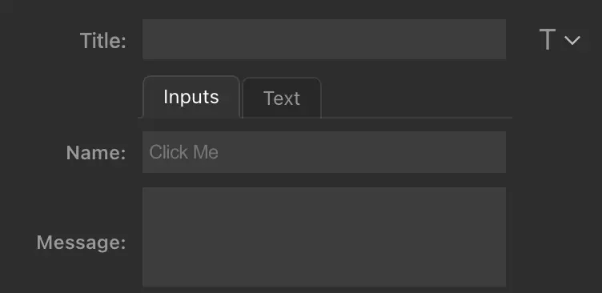

# Property Inspector

Stream Deck's integrated HTML5 Property Inspector allows you to communicate with your plugin from Stream Deck software.

<!-- TODO: Mark as deprecated and provide reference links to the new component library.  -->

## General operation

The property inspector's main view is wrapped in a `div` with the class `sdpi-wrapper`.

```html
<div class="sdpi-wrapper">
    ...
    your content goes here
    ...
<div>
```

Link the included stylesheet in the `<head>` tag of your property inspector's HTML.

```html
<head>
    <meta charset="utf-8" />
    <title>My Property Inspector</title>
    <link rel="stylesheet" href="sdpi.css">
</head>

<body>
    <div class="sdpi-wrapper">
        ...
    <div>
</body>
```

## Adding elements

Standard elements of Stream Deck's PI consist of a `label` and a `value`, each of which can be identified by their respective classes: `sdpi-item-label` and `sdpi-item-value`. Since you can add multiple label/value pairs, each of these pairs are wrapped into a `sdpi-item` node. The `sdpi-item` class to create a new item. Providing the type attribute adds the appropriate styling.

```html
<div class="sdpi-item" type="textarea">
```

### Supported Types

| HTML-Element                                             | SDPI-element               | Description                                                                                                                                                                                                                                                                                              |
| -------------------------------------------------------- | -------------------------- | -------------------------------------------------------------------------------------------------------------------------------------------------------------------------------------------------------------------------------------------------------------------------------------------------------- |
| [field](#textfield)                 | type="field" `<optional>`  | An input control, which lets the user enter short text (e.g. her name).                                                                                                                                                                                                                                  |
| [password](#textfield)              | type="password"            | An input control, which lets the user enter obscured text. Instead of characters, the field shows '•'. Text-input is contained in the element's `value`.                                                                                                                                                 |
| [email](#textfield)                 | type="email"               | An input control, which lets the user enter an email-address. Validation is NOT performed automatically.                                                                                                                                                                                                 |
| [date](#datetime)                   | type="date"                | An input control to enter a date.                                                                                                                                                                                                                                                                        |
| [month](#month)                     | type="month"               | An input control to select/display a month.                                                                                                                                                                                                                                                              |
| [week](#week)                       | type="week"                | An input control to select/display a week.                                                                                                                                                                                                                                                               |
| [time](#datetime-control)           | type="time"                | An input control to select/display a time.                                                                                                                                                                                                                                                               |
| [datetime-local](#datetime-control) | type="datetime-local"      | An input control to select/display a date/time string in ISO format (e.g. "2019-01-06T12:22").                                                                                                                                                                                                           |
| [button](#button)                   | type="button" `<optional>` | A styled HTML-button.                                                                                                                                                                                                                                                                                    |
| [textarea](#textarea)               | type="textarea"            | An input control, which lets the user enter multiple lines of text.                                                                                                                                                                                                                                      |
| [select](#select)                   | type="select"              | A regular `select` element can have `options` to select from.                                                                                                                                                                                                                                            |
| [checkbox](#checkbox)               | type="checkbox"            | A checkbox which lets a user select ('check') one or more of one or more choices.                                                                                                                                                                                                                         |
| [radio](#radio)                     | type="radio"               | A radio-button (mostly used in a group of radio-buttons) which lets a user select only one of a number of choices.                                                                                                                                                                                       |
| [range](#range)                     | type="range"               | A range (or slider) control, to let the user adjust a value (e.g. number or color)                                                                                                                                                                                                                       |
| [color](#color)                     | type="color"               | Shows a color-preview and let the user open a color-picker to change its value visually                                                                                                                                                                                                                 |
| [file](#file)                       | type="file"                | A file-upload element with label, which opens a file-dialog and lets the user choose a file. It differs a bit from the regular `file`selector, in that it allows you to pick up the full path of the selected file.              |
| [list](#list)                       | type="list"                | A regular `list` element to show items to select from. Ordered, unordered lists and other list-types are supported. |
| [table](#tables)                    | type="table"               | A table element.                                  |
| [group](#group)                     | type="group"               | A container, which allows grouping of arbitrary HTML elements (as the ones mentioned above)                                                                                                                                                                                                              |
| [line](#line)                       |                            | A regular `<hr>` element will add a horizontal line and spacing                                                                                                                                                                                                                                     |
| [heading](#heading)                 | class="sdpi-heading"       | Draws a horizontal line and additionally a nicely centered heading                                                                                                                                                                                                                                      |
| [meter](#meter)                     | type="meter"               | A horizontal meter, showing a value within a known range. [More info (mozilla.org)](https://developer.mozilla.org/en-US/docs/Web/HTML/Element/meter)                                                                                                                                                     |
| [progress](#progress)               | type="progress"            | A progressbar, typically showing the state of a certain progess (e.g. completion). [More info (mozilla.org)](https://developer.mozilla.org/en-US/docs/Web/HTML/Element/progress)                                                                                                                         |
| [details](#details)                 |                            | The `details` element is a complete widget on its own. It therefore occupies the full width of the PI's view by default. It can be used to create an interactive widget that the user can open and close.                                                         |
| [message](#message)                 |                            | The `message` element is similar to the `details`element. It doesn't show a disclosure-triangle, but you can add notification icons to it. It can be used to create an interactive widget that the user can open and close. You can put any content into it.                                       |

Note that only 'flat' `sdpi-item` structures are supported. That means, `sdpi-item` within another `sdpi-item` is _unsupported_ (some exceptions apply, see [Group](#group)). Adding `id` attributes to your elements is recommended.

### Textfield

```html
<div class="sdpi-item">
    <div class="sdpi-item-label">Name</div>
    <input class="sdpi-item-value" id="myname" value="" placeholder="Enter your name">
</div>
<div class="sdpi-item">
    <div class="sdpi-item-label">Email</div>
    <input class="sdpi-item-value" id="myemail" value="" placeholder="Enter your email-address">
</div>
```

.png>)


If you want to notify the user of a `required` value, you can simply add a `required` control, which shows a tiny exclamation mark, as long as there's no text in the field.

.png>)

```html
<div type="textarea" class="sdpi-item" id="required_text">
    <div class="sdpi-item-label">Text</div>
    <span class="sdpi-item-value">
        <input type="text"  id="mytext" required></input>
    </span>
</div>
```

A checkmark is displayed in completed fields:

.png>)

You can use the `pattern` attribute to specify a pattern to validate the IP-Address.

```html
<div class="sdpi-item" id="your_name" title="This field lets you enter an IP-Address. The little exclamation mark changes to a checkmark, if the condition is met (e.g. you entered an IP-address.).">
    <div class="sdpi-item-label">IP-Address</div>
    <input class="sdpi-item-value" id="myipaddress" value="" placeholder="e.g. 192.168.61.1" required pattern="\d{1,3}\.\d{1,3}\.\d{1,3}\.\d{1,3}">
</div>
```

Example patterns:

* 8 characters or more: `pattern=".{6,}"`
* 2-character country code (e.g. EN): `pattern="[A-Za-z]{2}"`

| Pattern                                         | Description                                                  |
| ----------------------------------------------- | ------------------------------------------------------------ |
| `pattern="\d{1,3}\.\d{1,3}\.\d{1,3}\.\d{1,3}"`  | IP-address                                                   |
| `pattern=".{8,}"`                               | 8 characters or more                                         |
| `pattern="[A-Za-z]{2}"`                         | 2 character country code                                     |
| `pattern="[^'\x22]+"`                           | no single or double quotes                                   |
| `pattern="(?=.*\d)(?=.*[a-z])(?=.*[A-Z]).{4,}"` | at least 4 characters, 1 uppercase, 1 lowercase and 1 number |

### Textarea

If you need to enter more text, you can add a `textarea` control, which allows for multi-line text.

```html
<div type="textarea" class="sdpi-item" id="message_only">
    <div class="sdpi-item-label">Message</div>
    <span class="sdpi-item-value textarea">
        <textarea type="textarea" id="mytextarea"></textarea>
    </span>
</div>
```

.png>)

You can add info-text to the bottom of the textarea by adding a `label` right after the `textarea` and giving the label a `for` attribute with the value of the textarea's id.

.png>)

```html
<div type="textarea" class="sdpi-item" id="message_only">
    <div class="sdpi-item-label">Message</div>
    <span class="sdpi-item-value textarea">
        <textarea type="textarea" maxlength="50" id="txa1"></textarea>
        <label for="txa1" >0/50</label>
    </span>
</div>
```

Adding a little JavaScript to PI's web-view, can make this into a nice counter:

```javascript
    document.querySelectorAll('textarea').forEach(e => {
    const maxl = e.getAttribute('maxlength');
    e.targets = document.querySelectorAll(`[for='${e.id}']`);
    if (e.targets.length) {
        let fn = () => {
            for(t of e.targets) {
                t.innerText = maxl ? `${e.value.length}/${maxl}` : `${e.value.length}`;
            }
        };
        fn();
        e.onkeyup = fn;
    }
});
```

### Button

```html
<div class="sdpi-item">
     <div class="sdpi-item-label">Button</div>
     <button class="sdpi-item-value" id="mybutton">Click Me</button>
</div>
```

.png>)

By default, the button's width takes the full available width. We included a couple of utility-classes in `sdpi.css` to restrict width of a button. e.g. class `max20` limits the width to approx 20% of the total width:

.png>)

```html
<div class="sdpi-item">
    <div class="sdpi-item-label">Button</div>
    <button class="sdpi-item-value max20" id="mybutton">Click Me</button>
</div>
```

#### Multiple buttons

Placing two buttons side by side will automatically arrange them horizontally (by the limits of the available space).

.png>)

```html
 <div class="sdpi-item">
     <div class="sdpi-item-label">Button</div>
     <button class="sdpi-item-value" id="mybutton">Click Me</button>
     <button class="sdpi-item-value" id="myotherbutton">Or Me</button>
</div>
```

This also works for other combinations of elements:

.png>)

```html
<div class="sdpi-item">
     <div class="sdpi-item-label">Button</div>
     <select class="sdpi-item-value select" id="myselect">
            <option value="janedoe@example.com">Jane Doe</option>
            <option value="someguy@example.com">Some Guy</option>
        </select>
      <button class="sdpi-item-value">Or Me</button>
</div>
```

### Select

Creating a HTML5 select box with a label is straightforward:

.png>)

```html
<div class="sdpi-item" id="select_single">
    <div class="sdpi-item-label">Select</div>
    <select class="sdpi-item-value select" id="myselect">
       <option value="20">20</option>
       <option value="50">50</option>
       <option value="100">100</option>
    </select>
</div>
```

HTML5 `optgroups` inside the select are supported as well:

.png>)

```html
<div class="sdpi-item" id="select_single">
    <div class="sdpi-item-label">Select</div>
    <select class="sdpi-item-value select" id="myselect">
       <optgroup label="Women">
           <option value="janedoe@example.com">Jane Doe</option>
           <option value="tinatank@example.com">Some Girl</option>
           <option value="yoko@example.com">Yoko Hama</option>
       </optgroup>
       <optgroup label="Men">
           <option value="johndoe@example.com">John Doe</option>
           <option value="tiptronic@example.com">Some Man</option>
           <option value="kingofprawns@example.com">Another Chap</option>
       </optgroup>
    </select>
</div>
```

### Checkbox

Creating a HTML5 checkboxes with a label is getting more involved because there's no themeable checkbox available in today's browsers and HTML renderers. Creating checkboxes generally works the same way:

#### Single Checkbox

A single checkbox doesn't require a separate value-container, so you can put the `sdpi-item-value` class right onto the input-element:

```html
<div type="checkbox" class="sdpi-item">
    <div class="sdpi-item-label">Check Me </div>
    <input class="sdpi-item-value" id="chk0" type="checkbox" value="left">
    <label for="chk0"><span></span>left</label>
</div>
```

In order to let the PI know there are a group of checkboxes, you just put these checkboxes into a `sdpi-item-value` wrapper...

```html
 <div type="checkbox" class="sdpi-item">
  <div class="sdpi-item-label">Check Me</div>
  <div class="sdpi-item-value ">
      <input id="chk1" type="checkbox" value="left">
      <label for="chk1"><span></span>left</label>
      <input id="chk2" type="checkbox" value="right">
      <label for="chk2"§><span></span>right</label>
  </div>
</div>
```

.png>)

Please note the additional `<span>` element, which is used to override the browser's default checkbox. It remains empty and serves just as a placeholder. This is a common technique to allow drawing custom checkboxes, radio-buttons, etc.

#### Multiple checkboxes

```html
<div type="checkbox" class="sdpi-item">
    <div class="sdpi-item-label">Check Me</div>
    <div class="sdpi-item-value ">
            <input id="chk1" type="checkbox" value="left">
            <label for="chk1" class="sdpi-item-label"><span></span>Monday</label>
            <input id="chk2" type="checkbox" value="right">
            <label for="chk2" class="sdpi-item-label"><span></span>Tuesday</label>
            <input id="chk3" type="checkbox" value="left">
            <label for="chk3" class="sdpi-item-label"><span></span>Wednesday</label>
            <input id="chk4" type="checkbox" value="right">
            <label for="chk4" class="sdpi-item-label"><span></span>Thursday</label>
            <input id="chk5" type="checkbox" value="left">
            <label for="chk5" class="sdpi-item-label"><span></span>Friday</label>
            <input id="chk6" type="checkbox" value="right">
            <label for="chk6" class="sdpi-item-label"><span></span>Saturday</label>
    </div>
</div>
```

#### Alignment

.png>)

We added a helper-node `sdpi-item-child`, which you can use to group checkboxes/radio-buttons and their labels for easier alignment. Please note the `min100` class in the parent element `sdpi-item-value min100`, which means the subsequent `sdpi-item-value` elements will be at least 100px wide. You can add CSS or even inline-styles to override this behavior. Using the `sdpi-item-child` class to 'group' input and label, will produce a much nicer output:

```html
<div type="checkbox" class="sdpi-item" id="multi-items">
    <div class="sdpi-item-label">Select day</div>
    <div class="sdpi-item-value min100">
        <div class="sdpi-item-child">
            <input id="days1" type="checkbox" value="left">
            <label for="days1" class="sdpi-item-label"><span></span>Monday</label>
        </div>
        <div class="sdpi-item-child">
            <input id="days2" type="checkbox" value="right">
            <label for="days2" class="sdpi-item-label"><span></span>Tuesday</label>
        </div>
        <div class="sdpi-item-child">
            <input id="days3" type="checkbox" value="center">
            <label for="days3" class="sdpi-item-label"><span></span>Wednesday</label>
        </div>
        <div class="sdpi-item-child">
            <input id="days4" type="checkbox" value="red" checked>
            <label for="days4" class="sdpi-item-label"><span></span>Thursday</label>
        </div>
        <div class="sdpi-item-child">
            <input id="days5" type="checkbox" value="green">
            <label for="days5" class="sdpi-item-label"><span></span>Friday</label>
        </div>
        <div class="sdpi-item-child">
            <input id="days6" type="checkbox" value="blue">
            <label for="days6" class="sdpi-item-label"><span></span>Saturday</label>
        </div>
    </div>
    </div>
```

***

### Radio

Creating an input of type `radio` follows the same logic as creating an input of type `checkbox`:

.png>)

```html
<div type="radio" class="sdpi-item" id="adjust_radio">
    <div class="sdpi-item-label">Adjust Radio</div>
    <div class="sdpi-item-value ">
        <span class="sdpi-item-child">
            <input id="radio1" type="radio" name="radio" >
            <label for="radio1" class="sdpi-item-label"><span></span>on</label>
        </span>
        <span class="sdpi-item-child">
            <input id="radio2" type="radio" value="off" name="radio" checked>
            <label for="radio2" class="sdpi-item-label"><span></span>off</label>
        </span>
        <span class="sdpi-item-child">
            <input id="radio3" type="radio" value="mute" name="radio">
            <label for="radio3" class="sdpi-item-label"><span></span>mute</label>
        </span>
    </div>
</div>
```

### Range

Creating a slider using the `range` type.

.png>)

```html
<div type="range" class="sdpi-item" id="temperatureslider">
    <div class="sdpi-item-label">Temperature</div>
    <div class="sdpi-item-value">
        <input type="range" min="0" max="100" value=37>
    </div>
</div>
```

For control-items like this, you can avoid the additional

```html
<div class="sdpi-item-value">
```

and add the class directly to the input, like so:

```html
<div type="range" class="sdpi-item" id="temperatureslider">
    <div class="sdpi-item-label">Temperature</div>
    <input type="range" class="sdpi-item-value" min="0" max="100" value=37>
</div>
```

#### Range with labels

To add labels to a range, however, a range must be grouped into a `sdpi-item-value`, and labels get added as `span` elements:

.png>)

```html
<div type="range" class="sdpi-item" id="range_with_meters">
    <div class="sdpi-item-label">Range (with label)</div>
    <div class="sdpi-item-value">
        <span class="clickable" value="0">0</span>
        <input type="range" min="0" max="100" value=74>
        <span class="clickable" value="100">100</span>
    </div>
</div>
```

A `span` of class `clickable` is intercepted, and the value of its 'range' element is set to the value specified in the 'value' attribute of the `span` element. If you leave out the `value` attribute from the `span` element, PI tries to use the value in the `span` text-node.

#### Range with `datalist`

Adding a data-list to a range produces `steps`. Pi's slider will snap to those steps.

.png>)

```html
<div type="range" class="sdpi-item" id="range_with_datalist">
    <div class="sdpi-item-label">Range (with datalist)</div>
    <div class="sdpi-item-value">
        <span class="clickable" value="0">0</span>
        <input type="range" min="0" max="100" step="25" list="numbers">
        <datalist id="numbers">
            <option>25</option>
            <option>50</option>
            <option>75</option>
        </datalist>
        <span class="clickable" value="100">100</span>
    </div>
</div>
```

### Color

Create a color-selector using the `range` type.

```html
<div type="range" class="sdpi-item" id="temperatureslider">
    <div class="sdpi-item-label">Temperature</div>
    <div class="sdpi-item-value">
        <input type="color" id="mycolor" value="#ff0000">
    </div>
</div>
```

.png>)

or the shorter version, which produces the same output:

```html
<div type="color" class="sdpi-item" id="colorselection">
    <div class="sdpi-item-label">Color</div>
    <input type="color" class="sdpi-item-value" id="mycolor" value="#ff0000">
</div>
```

#### Color with predefined selection

To present pre-defined color values, you can add a datalist to the color control. To make sure the list gets appended properly, set the `list` attribute of the `input` control to the `id` of the `datalist`. (in our example 'clrs')

.png>)

```html
 <div type="color" class="sdpi-item" id="colorselection">
    <div class="sdpi-item-label">Color</div>
    <input type="color" id="mycolorselection" class="sdpi-item-value" value="#3333cc" list="clrs" >
    <datalist id="clrs">
        <option>#ff0000</option>
        <option>#0000ff</option>
        <option>#00ff00</option>
        <option>#ffff00</option>
        <option>#3333cc</option>
        <option>#00ffff</option>
      </datalist>
</div>
```

### Date/Time

There are various date and time controls supported, using Chrome's integrated date and time pickers.

.png>)

### Date

Create a date element using the `date` type.

.png>)

```html
<div class="sdpi-item" type="date">
    <div class="sdpi-item-label">Date</div>
    <input class="sdpi-item-value" id="mydate" type="date" value="2019-01-15">
</div>
```

### Datepicker

A user can change the values individually or click a disclosure-triangle (which appears on `hover`) to show a date-picker control:

.png>)

Here are a couple of more date and time examples

### Date Range

Adding a `min` and a `max` value to the date-control, will allow the user to set a date in between these dates:

```html
<div class="sdpi-item">
    <div class="sdpi-item-label">Date range</div>
    <input id="when" name="when" type="date" min="2018-12-01" max="2019-02-01" value="2018-12-31">
</div>
```

### Datalist

You can present the user with a collection of pre-defined dates as well. Add a `<datalist>` node to the `sdpi-item`. To make sure the list gets appended properly, set the `list` attribute of the `input` control to the `id` of the `datalist`. (in our example 'events')

.png>)

```html
<div class="sdpi-item" id="date">
    <div class="sdpi-item-label">Date</div>
    <input class="sdpi-item-value" id="myevents" type="date" value="yyyy-mm-dd" list="events">
    <datalist id="events">
        <option label="Elgato Live Stream">2019-01-06</option>
        <option label="Incredible event">2019-01-15</option>
        <option label="Palo Alto LAN party">2019-02-05</option>
        <option label="Something else">2019-12-31</option>
      </datalist>
</div>
```

### Month

It is also possible to restrict the settable values to months:

.png>)

```html
<div class="sdpi-item">
    <div class="sdpi-item-label">Month</div>
    <input class="sdpi-item-value" id="month" type="month" value="2019-01">
</div>
```

#### Month with pre-defined values

You can present the user with a collection of pre-defined months. Add a `<datalist>` node to the `sdpi-item`. To make sure the list gets appended properly, set the `list` attribute of the `input` control to the `id` of the `datalist`. (in our example 'months')

```html
<div class="sdpi-item" id="month">
    <div class="sdpi-item-label">Month</div>
    <input class="sdpi-item-value" id="month" type="month" value="2019-01" list="months">
    <datalist id="months">
        <option label="Neil on the moon">1967-07</option>
        <option label="First month of this century">2000-01</option>
        <option label="Last month of last century">1999-12</option>
        <option label="Last month of 2019">2019-12</option>
      </datalist>
</div>
```

### Week

It is also possible to restrict the settable values to weeks:

.png>)

```html
<div class="sdpi-item">
    <div class="sdpi-item-label">Week</div>
    <input class="sdpi-item-value" id="week" type="week" value="2019-W02">
</div>
```

#### Week with pre-defined data

You can present the user with a collection of pre-defined weeks. Add a `<datalist>` node to the `sdpi-item`. To make sure the list gets appended properly, set the `list` attribute of the `input` control to the `id` of the `datalist`. (in our example 'weeks')

```html
<div class="sdpi-item" id="week">
    <div class="sdpi-item-label">Week</div>
    <input class="sdpi-item-value" id="longweek" type="week" value="2019-W02" list="weeks">
    <datalist id="weeks">
        <option label="First week of 2019">2019-W01</option>
        <option label="Second week of 2019">2019-W02</option>
        <option label="24th week of 2019">2019-W24</option>
        <option label="Last week of 2019">2019-W52</option>
      </datalist>
</div>
```

### DateTime control

A combined `datetime` control allows to set both date and time based on the user's current time-zone:

.png>)

```html
<div class="sdpi-item">
    <div class="sdpi-item-label">Week</div>
    <input class="sdpi-item-value" id="longweek" type="week" value="2019-W02">
</div>
```

### List

Using a list control, you can present the user with a list of items. Supported classes are:

| Class                  | Description                                    |
| ---------------------- | ---------------------------------------------- |
| no-select `<optional>` | List just shows scrollable items               |
| single-select          | List highlights the currently clicked/active item |
| multi-select           | Allows selecting multiple items                |

For `single-select` and `multi-select`, a `selected` class is applied to the selected/clicked list-item.

.png>)

#### Unordered List

```html
<div type="list" class="sdpi-item list" id="unorderedListContainer">
    <div class="sdpi-item-label">List (unordered)</div>
    <ul class="sdpi-item-value no-select" id="unorderedList">
        <li>Milk</li>
        <li>Bread</li>
        <li>Chocolate</li>
        <li>More chocolate</li>
    </ul>
</div>
```

#### Ordered List

.png>)

```html
<div type="list" class="sdpi-item list" id="orderedListContainer">
    <div class="sdpi-item-label">List (ordered)</div>
    <ol class="sdpi-item-value" id="orderedList" type="none">
        <li>Milk</li>
        <li>Bread</li>
        <li>Chocolate</li>
        <li>More chocolate</li>
    </ol>
</div>
```

| Property             | Description                                                     |
| -------------------- | --------------------------------------------------------------- |
| none                 | List just shows its text                                        |
| decimal              | Shows a decimal number before the row                           |
| decimal-leading-zero | Shows a decimal number padded with a leading '0' before the row |
| lower-alpha          | Shows a lowercase alphabetical character before the row         |
| upper-alpha          | Shows an uppercase alphabetical character before the row        |
| lower-roman          | Shows a lowercase roman number before the row                   |
| upper-roman          | Shows an uppercase roman number before the row                  |

### Single Select

.png>)

```html
<div type="list" class="sdpi-item list" id="orderedListContainer1">
    <div class="sdpi-item-label">List</div>
    <ol class="sdpi-item-value single-select" id="orderedList1" type="decimal">
        <li>Milk</li>
        <li>Bread</li>
        <li>Chocolate</li>
        <li>More chocolate</li>
    </ol>
</div>
```

### Multi Select

.png>)

```html
<div type="list" class="sdpi-item list" id="orderedListContainer2">
    <div class="sdpi-item-label">Multi select</div>
    <ol class="sdpi-item-value multi-select" id="orderedList2" type="lower-alpha">
        <li>Coke</li>
        <li>Sprite</li>
        <li>Juice</li>
        <li>Water</li>
        <li>Mocktail</li>
        <li>Smoothies</li>
    </ol>
</div>
```

### Tables

Present the user with a table of values.

.png>)

In our sample plugin, we show how you can make them interactive/clickable by adding a class to the table. Supported classes are:

| Class                  | Description                                                 |
| ---------------------- | ----------------------------------------------------------- |
| no-select `<optional>` | Table just shows scrollable items                           |
| single-select          | Table highlights the currently clicked/active item             |
| multi-select           | Allows selecting multiple items. (no modifier key required) |

For `single-select` and `multi-select`, a `selected` class is applied to the selected/clicked table-item `td`.

```html
 <div class="sdpi-item" id="tableid">
    <div class="sdpi-item-label">Table (no-select)</div>
    <table class="sdpi-item-value no-select" width="100%">
        <caption>Table without selection</caption>
        <tr>
            <td>One</td>
            <td>Two</td>
            <td>Three</td>
        </tr>
        <tr>
            <td>1.00</td>
            <td>2.00</td>
            <td>3.00</td>
        </tr>
        <tr>
            <td>west</td>
            <td>east</td>
            <td>south</td>
        </tr>
    </table>
</div>
```

#### Table with Single Selection

.png>)

Creating a table which shows a single selection by adding a `single-select` class to the table:

```html
<div class="sdpi-item" id="tableid1">
    <div class="sdpi-item-label">Table (single-select)</div>
    <table class="sdpi-item-value single-select" width="100%">
        <caption>Table with single selection</caption>
        <tr>
            <td>Four</td>
            <td>Five</td>
            <td>Six</td>
        </tr>
        <tr>
            <td>4.00</td>
            <td>5.00</td>
            <td>6.50</td>
        </tr>
        <tr>
            <td>west</td>
            <td>east</td>
            <td>south</td>
        </tr>
    </table>
</div>
```

#### Table with multi selection

Adding a `multi-select` class to the table creates a table showing multiple selected cells:

.png>)

```html
<div class="sdpi-item" id="tableid2">
    <div class="sdpi-item-label">Table (multi-select)</div>
    <table class="sdpi-item-value multi-select" width="100%">
        <caption>Table with multi selection</caption>
        <tr>
            <td>Seven</td>
            <td>Eight</td>
            <td>Nine</td>
        </tr>
        <tr>
            <td>7.00</td>
            <td>8.00</td>
            <td>9.99</td>
        </tr>
        <tr>
            <td>west</td>
            <td>east</td>
            <td>south</td>
        </tr>
    </table>
</div>
```

### File

#### File Selector

To add a file-selector to the PI, you can add a type of `file` and a class `sdpi-item-value` to the HTML. The integrated file-selector, returns a 'fakepath' as its value (and shows it in the label). You will need to write your own code for reading the contents of the file.

.png>)

```html
<div class="sdpi-item" id="my_private_file_selectorx">
    <div class="sdpi-item-label">Select File</div>
    <input class="sdpi-item-value" id="myfile" type="file" accept=".jpg, .jpeg, .png">
</div>
```

#### Property inspector's file-selector

You will want to pass a file path back to your plugin. We added custom elements and styling to the file selector.

.png>)

```html
<div class="sdpi-item" id="my_private_file_selector">
    <div class="sdpi-item-label">Select File</div>
    <div class="sdpi-item-group file" id="filepickergroup">
        <input class="sdpi-item-value" id="myfile" type="file" accept=".jpg, .jpeg, .png">
        <label class="sdpi-file-info " for="elgfilepicker">no file...</label>
        <label class="sdpi-file-label" for="elgfilepicker">Choose file...</label>
    </div>
</div>
```

`sdpi-file-info` will receive the file-name `sdpi-file-label` replaces the original 'Choose file...' button.

Clicking both elements will trigger and show the file-selector-dialog. To ensure proper styling, just group those elements in a `sdpi-item-group` and add a class `file`. The included sample code will fill the elements as needed. If you don't need to show the file name, you can just leave the `sdpi-file-info` out. Only the `sdpi-file-label` is required since it triggers the file dialog.

The file-selector returns an URLencoded absolute file path. (e.g. `%2FUsers%2Fandy%2FDesktop%2Fmarina.png`). To convert this back to a string, you must decode this string first using `decodeURIComponent`.

Please note: Chromium adds (for security reasons) a 'fake' string `C:\\fakepath\\`, so you must strip this fakepath to get to the 'real' path, like so:

```javascript
if (element.type === 'file') {
    result = decodeURIComponent(element.value.replace(/^C:\\fakepath\\/, ''));
}
```

The `sdpi-file-info` label needs to be manually populated with the previously selected file path once the PI is loaded.

```javascript
document.querySelector('.sdpi-file-info[for="elgfilepicker"]').textContent = 'marina.png';
```

### Group

Group elements together using a `sdpi-item-group` element.

As with any other `sdpi-item`, a group can have a label. The main difference to a regular `sdpi-item-label` is that the group's label is left-aligned and can fill the whole space above a group (e.g. it can be a longer and more descriptive string).

The structure of a group is similar to a regular `sdpi-item`, with the exception, the group's value is the actual `sdpi-item-group`, which - in turn - contains any regular `sdpi-item` (just as shown above)

.png>)

```html
<div type="group" class="sdpi-item" id="messagegroup">
    <div class="sdpi-item-label">Send A Message</div>
    <div class="sdpi-item-group" id="messagegroup_items">
        <div type="select" class="sdpi-item" id="messagegroup_account">
            <div class="sdpi-item-label">Account ID</div>
            <select class="sdpi-item-value select">
                <option value="janedoe@example.com">Jane Doe</option>
                <option value="someguy@example.com">Some Guy</option>
                <option value="anotherchap@example.com">Another Chap</option>
            </select>
        </div>
        <div type="textarea" class="sdpi-item" id="messagegroup_message">
            <div class="sdpi-item-label">Message</div>
            <div class="sdpi-item-value textarea">
                <textarea type="textarea"></textarea>
            </div>
        </div>
    </div>
</div>
```

### Line

You can draw a horizontal line using HTML5's `<hr>` element. This draws a line from left to right, over the full width of PI's viewable pane (minus some margin). This can be helpful to separate different inspector elements or groups.

```html
<hr>
```

***

### Heading

A heading lets you place a nice heading above (or below) a `sdpi-item`.

.png>)

To add a heading, simply place a `div` with a class `sdpi-heading` outside a `sdpi-item`:

```html
<div class="sdpi-heading">MY HEADLINE</div>
```

### Meter

A horizontal meter.

.png>)

```html
<div class="sdpi-item" id="your_name">
    <div class="sdpi-item-label">Meter</div>
    <meter class="sdpi-item-value" value="0.7"></meter>
</div>
```

#### Multiple meters

Like other controls, you can add multiple meters to the output. Since `Meter` controls are meant 'read-only', you should give every meter node its own class of `sdpi-item-value` (especially if you want to later make them interactive - e.g. clickable individually).

.png>)

```html
<div class="sdpi-item" type="progress" id="multimeter">
    <div class="sdpi-item-label">Meter</div>
    <meter class="sdpi-item-value" value="0.6"></meter>
    <meter class="sdpi-item-value" value="0.2"></meter>
    <meter class="sdpi-item-value" value="0.8"></meter>
</div>
```

#### Full width meters

To stack meter-controls vertically and apply full width, we included a helper-class `full` in the `sdpi.css`, which will produce full-width controls:

.png>)

```html
<div class="sdpi-item" id="meter_full">
    <div class="sdpi-item-label">Meter</div>
    <div class="sdpi-item-value sdpi-item-group" id="metergroup">
        <meter class="sdpi-item-value full" value="0.4"></meter>
        <meter class="sdpi-item-value full" value="0.2"></meter>
        <meter class="sdpi-item-value full" value="0.7"></meter>
    </div>
 </div>
```

#### Meters with labels

Adding labels to a meter requires grouping the meters in a separate child-node containing the left label, the meter, and the right label, which then will produce an output similar to this:

.png>)

```html
<div class="sdpi-item" type="meter" id="meter_with_labels">
    <div class="sdpi-item-label">Meter</div>
    <div class="sdpi-item-value" id="metergroup">
        <div class="sdpi-item-child">
            <span for="meter1">0</span>
            <meter id="meter1" class="sdpi-item-value full" value="0.4"></meter>
            <span for="meter1">100</span>
        </div>
        <div class="sdpi-item-child">
            <span>-17</span>
            <meter class="sdpi-item-value full" value="0.2"></meter>
            <span>37.2</span>
        </div>
        <div class="sdpi-item-child">
            <span>Min</span>
            <meter class="sdpi-item-value full" value="0.7"></meter>
            <span>Max</span>
        </div>
    </div>
 </div>
```

### Progress

A progress element is similar to the meter element but slightly different visual output.

.png>)

```html
 <div class="sdpi-item" type="progress" id="progress">
    <div class="sdpi-item-label">Progress</div>
    <progress class="sdpi-item-value" value="0.6" max="1"></progress>
</div>
```

Note: For the `progress` element, you need to set the `max` attribute; otherwise, a value from 0..1 is assumed.

#### Multiple Progress Elements

Like other controls, you can add multiple progress elements to the output.

Please note: Since `Progress` controls are meant 'read-only', you should give every meter node its own class of `sdpi-item-value` (especially if you want to later make them interactive - e.g. clickable individually).

.png>)

```html
<div class="sdpi-item" type="progress" id="multiprogress">
    <div class="sdpi-item-label">Progress</div>
    <progress class="sdpi-item-value" value="0.6" max="1"></progress>
    <progress class="sdpi-item-value" value="0.2" max="1"></progress>
    <progress class="sdpi-item-value" value="0.8" max="1"></progress>
</div>
```

### Full Width Meters

To stack progress-controls vertically and apply full width, we included a helper-class `full` in the `sdpi.css`, which will produce full-width controls:

.png>)

```html
<div class="sdpi-item" type="progress" id="progress_full">
    <div class="sdpi-item-label">Progress (full)</div>
    <div class="sdpi-item-value sdpi-item-group" id="metergroup">
        <progress class="sdpi-item-value full" value="0.4" max="1"></progress>
        <progress class="sdpi-item-value full" value="0.2" max="1"></progress>
        <progress class="sdpi-item-value full" value="0.7" max="1"></progress>
    </div>
 </div>
```

### Progress with labels

Adding labels to a meter requires grouping the meters in a separate child-node containing the left label, the meter, and the right label, which then will produce an output similar to this:

.png>)

```html
<div class="sdpi-item" type="progress" id="progress_with_labels">
    <div class="sdpi-item-label">Progress <br>(with labels)</div>
    <div class="sdpi-item-value sdpi-item-group" id="progressgroup">
        <div class="sdpi-item-child">
            <span for="progress1">0</span>
            <progress id="progress1" class="sdpi-item-value full" value="40" max="100"></progress>
            <span for="progress1">100</span>
        </div>
        <div class="sdpi-item-child">
            <span>0</span>
            <progress class="sdpi-item-value full" value="25" max="37.2"></progress>
            <span>37.2</span>
        </div>
        <div class="sdpi-item-child">
            <span>Min</span>
            <progress class="sdpi-item-value full" value="70" max="200"></progress>
            <span>Max</span>
        </div>
    </div>
 </div>
```

### Details

This element's content can be shown or collapsed (much like an accordion). It can contain a `summary` and/or additional text or HTML elements.

```html
<details>
    <summary>More Info</summary>
    <p>Put some text here.</p>
    <h4>Create Headlines</h4>
    <p>Whatever you like</p>
</details>
```

.png>)

A `details` element's default state is 'closed'. In this state, it only shows a disclosure triangle. Clicking the disclosure triangle will disclose the `details` of the element:

#### Details content

The `details` element is a kind of 'widget' on its own, in that it can contain arbitrary other HTML elements, which are disclosed as soon as the disclosure triangle is clicked.

#### Wrapped Details

You _can_ wrap the details-item into a regular `sdpi-item` like so:

```html
<div class="sdpi-item">
<div class="sdpi-item-label">Details</div>
<details class="sdpi-item-value">
    <summary>Some Details here</summary>
    <p>Here are some details.</p>
    ...
</details>
</div>
```

.png>)

but it will also work on its own:

```html
<details>
    <summary>More Info</summary>
    <p>This is Stream Deck's Property Inspector.</p>
    <p>To find out how things work, just open the 'index_pi.html' included in this plugin and compare to what's shown in Stream Deck</p>
    <a href="#">More info...</a>
</details>
```

#### Unwrapped Details

.png>)

You most likely want to show the user information about your plugin (or its usage). Allowing the `details` element to flow across the full width of PI's view pane will give you more space to present your information.

### Message

The `message`element is similar to the [details](broken-reference/). It allows you to show a bolder message to your users:

.png>)

#### Message icons

Depending on the significance of the message, you can also add an icon to the message by just appending a class to the `message` class:

.png>)

```html
<details class="message question">
    <summary>This is some message</summary>
</details>
```

Supported icons types are:

| Class    | Description                                      |
| -------- | ------------------------------------------------ |
| info     | .png>)     |
| caution  | .png>)  |
| question | .png>) |

This element's content can get shown or collapsed. It can contain a `summary` and/or additional text or HTML elements.

#### Message content

A `message` element's default state is 'closed'. In this state, it only shows the message in `summary`. If the `message` element contains further information, you can click the summary to disclose this information.

.png>)

```html
<details class="message">
    <summary>This is some message</summary>
    <h4>Information:</h4>
    <p>In this area you can type some information to your user.</p>
    <a class="info" href="#">Click here</a>
</details>
```

Hint: If you add an anchor element to the HTML, you can add one of the supported icons here as well...

### Tabs

If your property inspector contains many entries (or you want to add some structure), you can use the `tabs` element:

```html
<div type="tabs" class="sdpi-item">
        <div class="sdpi-item-label empty"></div>
        <div class="tabs">
            <div data-localize class="sdpi-item-label" title="This will get a tooltip">Name</div>
            <div data-localize class="tab" data-target="#tab2" title="Here's some more">Text</div>
        </div>
    </div>
    <hr class="tab-separator" />
    <div id="tab1" class="tab-container">
            <div class="sdpi-item">
            <...your content goes here>
            </div>
    </div>
    <div id="tab2" class="tab-container">
            <div class="sdpi-item">
            <...your content goes here>
            </div>
    </div>
</div>
```



* a tab must have the class `tab`
* a tab must have a `data-target` attribute that points to the id of the content (e.g. `#tab1`)
* the content must have the class `tab-content`
* the content must have a `id` that matches the `data-target` attribute of the tab

To make the tabs clickable, you can use the following code:

```javascript
function activateTabs(activeTab) {
    const allTabs = Array.from(document.querySelectorAll('.tab'));
    let activeTabEl = null;
    allTabs.forEach((el, i) => {
        el.onclick = () => clickTab(el);
        if(el.dataset?.target === activeTab) {
            activeTabEl = el;
        }
    });
    if(activeTabEl) {
        clickTab(activeTabEl);
    } else if(allTabs.length) {
        clickTab(allTabs[0]);
    }
}

function clickTab(clickedTab) {
    const allTabs = Array.from(document.querySelectorAll('.tab'));
    allTabs.forEach((el, i) => el.classList.remove('selected'));
    clickedTab.classList.add('selected');
    activeTab = clickedTab.dataset?.target;
    allTabs.forEach((el, i) => {
        if(el.dataset.target) {
            const t = document.querySelector(el.dataset.target);
            if(t) {
                t.style.display = el == clickedTab ? 'block' : 'none';
            }
        }
    });
}
```

## Interactivity

To gain full interactivity from Property Inspector to the plugin, the Property Inspector must be able to send messages to the plugin.

### Registration

Once the Property Inspector is instantiated (and thus its webpage is loaded), the Stream Deck application sends a `connectElgatoStreamDeckSocket` message to it, which contains various information needed to communicate between the Property Inspector and the Stream Deck software.

```javascript
function connectElgatoStreamDeckSocket(inPort, inPropertyInspectorUUID, inRegisterEvent, inInfo, inActionInfo);
```

Please note that the Property Inspector is instantiated every time the user selects a key to configure.

Using the `connectElgatoStreamDeckSocket`'s `inPort` parameter, you are now able to establish a proper Websocket-communication with Stream Deck software using a standard HTML5 `WebSocket` instance:

```javascript
websocket = new WebSocket('ws://localhost:' + inPort);
```

Now the Property Inspector registers itself with Stream Deck software, like so:

```javascript
websocket.onopen = function () {
 var json = {
  "event": inRegisterEvent,
  "uuid": inPropertyInspectorUUID
 };

 websocket.send(JSON.stringify(json));
};
```

The Property Inspector will receive messages through the Websocket's `onmessage` event:

```javascript
websocket.onmessage = function (evt) {
    // do something with the messages
}
```

More details about this procedure is found here: Property Inspector registration

### Sending Messages to a plugin

After the connection from the Property Inspector to the Stream Deck application is established, you can send messages to your plugin. The Stream Deck software expects a `stringified` JSON structure to be able to pass the message to the proper plugin:

```javascript
const json = {
    "action": "com.example.tutorial.action1",
    "event": "sendToPlugin",
    "context": <uniqueValue>, // as received from the 'connectElgatoStreamDeckSocket' event
    "payload": {}
};

websocket.send(JSON.stringify(json));
```

The JSON's `payload` can be anything you like, as long as it is possible to send it as _string_ through a WebSocket (Your plugin is responsible for handling the data).

### PI lifecycle events

When the Property Inspector closes, standard HTML5 lifecycle events are sent. You can add a listener to these events, e.g. to signal your plugin, the PI is no longer available, and thereby you don't need to send further data to it. This is good practice to avoid unnecessary traffic on the WebSocket.

To subscribe to these events, you may install an event listener on the PI window. When you receive one of these events, you can signal your plugin; the PI will be closed.

Examples:

**`beforeunload`-event**

```javascript
window.addEventListener('beforeunload', function (e) {
    e.preventDefault();
    sendValueToPlugin('propertyInspectorWillDisappear', 'property_inspector');
    // Don't set a returnValue to the event, otherwise Chromium with throw an error.
});
```

**`pagehide`-event**

```javascript
/** the pagehide event is fired when the view disappears */

window.addEventListener('pagehide', function (event) {
    sendValueToPlugin('propertyInspectorPagehide', 'property_inspector');

});
```

**`unload`-event**

```javascript
/** the unload event is fired, when the PI will finally disappears */
window.addEventListener('unload', function (event) {
    sendValueToPlugin('propertyInspectorDisconnected', 'property_inspector');
});
```

### Sample Property Inspector

We need an input control to enter data. In this example, we use an HTML `select` to send some values to the plugin.

According to the documentation [above](broken-reference/), we add a `select` control to Property Inspector's `sdpi-wrapper`:

```html
<div class="sdpi-wrapper">
    <div type="select" class="sdpi-item">
        <div class="sdpi-item-label">Change Value</div>
        <select class="sdpi-item-value" onchange="sendValueToPlugin(event.target.value, 'myIdentifier')">
            <option selected value="0">0</option>
            <option value="1">1</option>
            <option value="2">2</option>
            <option value="3">3</option>
            <option value="4">4</option>
            <option value="5">5</option>
            <option value="6">6</option>
            <option value="7">7</option>
            <option value="8">8</option>
            <option value="9">9</option>
        </select>
    </div>
 </div>
```

`onChange` will trigger a `sendToPlugin` Stream Deck event.

| Parameter  | Description                                                                                                                                                                                                                                                                                                                                                                                                                                                                                       |
| ---------- | ------------------------------------------------------------------------------------------------------------------------------------------------------------------------------------------------------------------------------------------------------------------------------------------------------------------------------------------------------------------------------------------------------------------------------------------------------------------------------------------------- |
| value      | the value of the event's target (in this case the `select`)                                                                                                                                                                                                                                                                                                                                                                                                                                       |
| identifier | a custom identifier (which can be anything you like). This value will get the `key` of our value, so the plugin's receiving function can identify what the value is supposed to do. Note in our example, we could simply pass the value with an arbitrary key because there's only one value sent, but as soon as there are more controls involved, the plugin needs to know which of the control's values is being sent. So it seems to be a good practice to use this strategy even for setups. |

With this information, we are now able to write a function, which handles the reception of the `onChange` event and passes its value on to Stream Deck (and thereby to the plugin):

```javascript
 function sendValueToPlugin(value, param) {

    // say the websocket connection is saved in the variable 'websocket'
    if (websocket) {
        // compile our JSON object.

        const json = {
                "action": "com.example.tutorial.action1",
                "event": "sendToPlugin",
                "context": <uniqueValue>, // as received from the 'connectElgatoStreamDeckSocket' callback
                "payload": {
                    // here we can use ES6 object-literals to use the  'param' parameter as a JSON key. In our example this resolves to {'myIdentifier': <value>}
                    [param] : value;  
                }
         };
         // send the json object to the plugin
         // please remember to 'stringify' the object first, since the websocket
         // just sends plain strings.
         websocket.send(JSON.stringify(json));
    }

}
```

One missing part is the included styling contained in `sdpi.css` which is included in the samples and can quickly be added to the HTML's `<head>` section:

```html
<head>
    <meta charset="utf-8" />
    <title>com.elgato.sample PI</title>
    <link rel="stylesheet" href="sdpi.css">
</head>
```

Now we have all needed elements set, to try out our first custom Property Inspector. Here's the complete HTML:

```html
<!DOCTYPE html>
<html>

<head>
    <meta charset="utf-8" />
    <title>com.elgato.sample PI</title>
    <link rel="stylesheet" href="sdpi.css">
</head>

<body>
    <div class="sdpi-wrapper">
        <div type="select" class="sdpi-item">
            <div class="sdpi-item-label">Change Value</div>
            <select class="sdpi-item-value" onchange="sendValueToPlugin(event.target.value, 'myIdentifier')">
                <option selected value="0">0</option>
                <option value="1">1</option>
                <option value="2">2</option>
                <option value="3">3</option>
                <option value="4">4</option>
                <option value="5">5</option>
                <option value="6">6</option>
                <option value="7">7</option>
                <option value="8">8</option>
                <option value="9">9</option>
            </select>
        </div>
     </div>
     <script>
        // this is our global websocket, used to communicate from/to Stream Deck software
        // and some info about our plugin, as sent by Stream Deck software
        var websocket = null,
        uuid = null,
        actionInfo = {};

        function connectElgatoStreamDeckSocket(inPort, inUUID, inRegisterEvent, inInfo, inActionInfo) {
            uuid = inUUID;
            // please note: the incoming arguments are of type STRING, so
            // in case of the inActionInfo, we must parse it into JSON first
            actionInfo = JSON.parse(inActionInfo); // cache the info
            websocket = new WebSocket('ws://localhost:' + inPort);

            // if connection was established, the websocket sends
            // an 'onopen' event, where we need to register our PI
            websocket.onopen = function () {
                var json = {
                    event:  inRegisterEvent,
                    uuid:   inUUID
                };
                // register property inspector to Stream Deck
                websocket.send(JSON.stringify(json));
            }
        }

        // our method to pass values to the plugin
        function sendValueToPlugin(value, param) {
            if (websocket) {
                const json = {
                        "action": actionInfo['action'],
                        "event": "sendToPlugin",
                        "context": uuid,
                        "payload": {
                            [param] : value
                        }
                 };
                 websocket.send(JSON.stringify(json));
            }
        }
     </script>
</body>
</html>
```

## Debugging

To debug your Property Inspector, you can use Chrome's developer tools. By default, you will find the remote-debugger at `http://localhost:23654/`.

Once activated, our freshly created Property Inspector will look something like this:

.png>)
